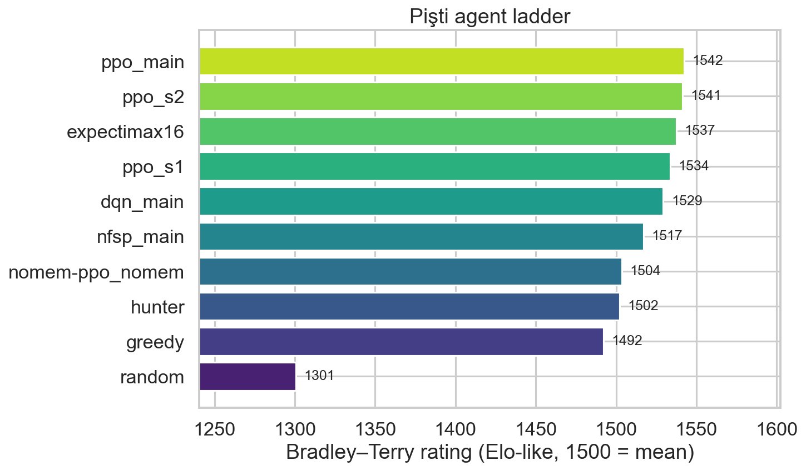
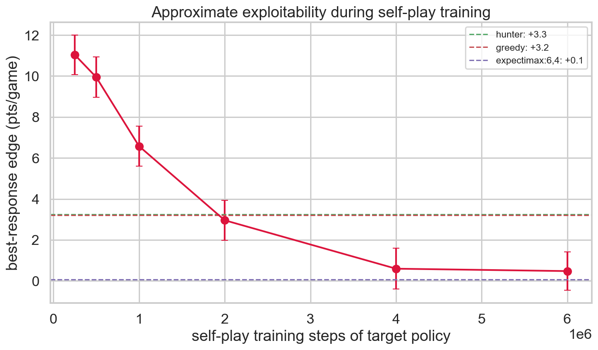
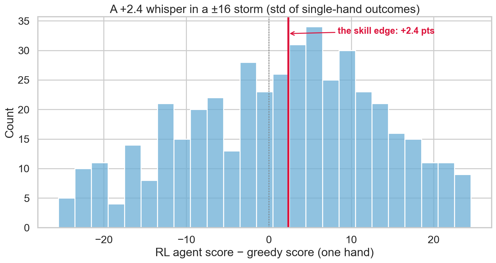
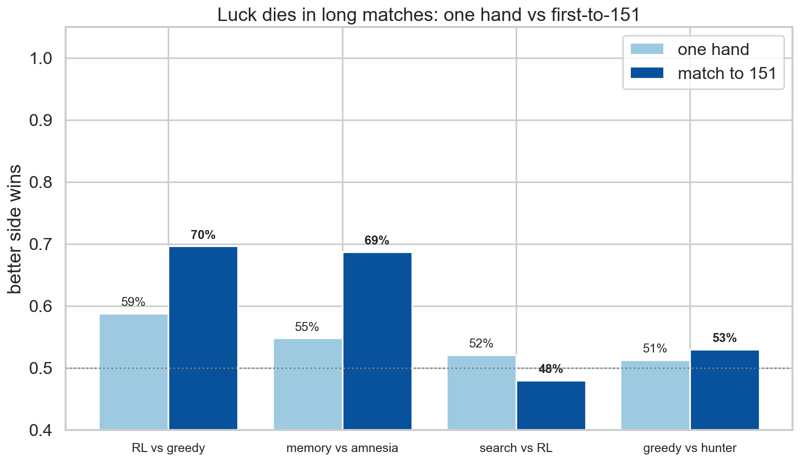
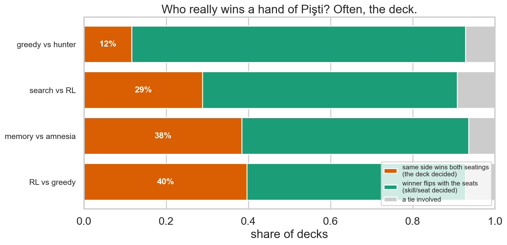

# We taught a neural network Pişti. Then we tried to break it.

*The fun version of [REPORT.md](REPORT.md) — same data, same statistics, better story. One overnight run on a MacBook, ~30,000 games of Pişti, one agent that learned to count cards.*

---

## The one-sentence version

A self-play RL agent taught itself Pişti from nothing but final scores, reached the top of the ladder in 67 minutes, became **statistically impossible to exploit** — and along the way we measured exactly how much of Pişti is luck, what card-counting is worth, and why being predictable is the most expensive habit in card games.

---

## 1. The ladder

Eight agents, every pair playing 500 games on mirrored decks (you get the same cards your opponent had — no luck excuses).



Three clean tiers, and the gaps *between* tiers are statistically bulletproof (p < 0.02 after correcting for 28 simultaneous comparisons):

| tier | who | what separates them |
|---|---|---|
| 🥇 | RL agents (PPO ×3, DQN) + expectimax search | ~2–3.5 pts/game over the heuristics |
| 🥈 | amnesiac RL, pişti-hunter, greedy | competent capture play |
| 🥉 | random | −10.5 pts/game vs everyone. bless. |

Within the top tier? **Dead heat.** The RL agent and the search agent are statistically indistinguishable after 500 head-to-head games (−0.4 ±1.2 pts). Two completely different kinds of intelligence — one learned from 6 million games of experience, one simulates futures in real time — landing on the same strength. ([heatmap](plots/tournament_heatmap.png))

## 2. The agent that became unbreakable

This is the result we'd frame and hang on a wall. For each training snapshot, we trained a dedicated **assassin** — a best-response network whose only job is to exploit that exact policy — and measured how badly it wins:



- **At 250k steps:** the assassin wins by **+11 pts/game** (78% of games). The young agent has habits, and habits are food.
- **At 1M steps** the agent starts playing against its own past selves (self-play league), and the free lunch ends fast.
- **At 4M+ steps:** the assassin's edge is **+0.5 ±0.9 — statistically zero** (p = 0.31). It cannot reliably beat the thing it was built to kill.

For contrast: the same assassin protocol takes **+3.2 pts/game** off greedy, forever. The scripted agents never stop being food; the RL agent left the menu.

**The predictability tax.** Greedy and hunter aren't exploitable because they're weak — they're exploitable because they're *predictable from the table alone*: if you can see the pile, you know what greedy will do. Meanwhile the expectimax agent — whose only randomness is Monte-Carlo sampling noise — measures **+0.06 (unexploitable) without any training at all**. Unpredictability isn't style, it's armor. But where the armor actually comes from surprised us — see the next section.

## 2½. We made a prediction. The data killed it.

Game theory says equilibrium play in hidden-information games requires *mixed strategies* — you must randomize. So we registered a prediction: a **DQN**, which ends training as a purely *deterministic* policy (always the argmax, zero dice), should pay the predictability tax even if it climbs the ladder. We trained one in the identical self-play league and sent the assassin after it.

Result: DQN reached the top tier (statistically tied with all three PPO seeds, beat every heuristic) — and the assassin took **+0.23 ±0.98 off it. Statistically zero. Unexploitable.** Prediction: dead. 🪦

The autopsy is the best insight of the study: **you don't need dice when you have a hidden hand.** A deterministic rule applied to *private* information — your cards, your memory of the deal — is already unpredictable from across the table, because the shuffle supplies the randomness. The opponent can't predict your "deterministic" move without knowing your hand. Greedy's real sin was never determinism; it's that its moves are predictable *from public information alone* (and its habits never change). The mixing that game theory demands was hiding in the deck the whole time.

Bonus DQN fact: off-policy replay is brutally sample-efficient here — DQN matched greedy after **~50k steps**; PPO needed ~1.5M (30×) to get there.

## 2¾. Then we hired the theorist.

Our league agents became unexploitable *empirically* — no guarantees, it just happened. So we brought in **NFSP**, the method with an actual theorem-shaped story: it maintains a best-response network and a long-run *average* of its own best responses, and that average provably drifts toward Nash equilibrium. Pure self-play, no curriculum, no training wheels. 10 million steps.

The verdict: the theorist is **safe but not sharp**. NFSP's exploitability is statistically zero (+0.74 ±0.99) — it kept the theoretical promise. But on the ladder it sits on its own rung (1517): clearly above every heuristic, clearly below the league agents (~1530–1542), losing about a point per game to each of them. The street-trained agents got the same armor *plus* more punch, in fewer steps.

One more gift from the theorist: NFSP's internal best response — which trained against the average policy 7× longer than our external assassin — finds **+1.15 pts/game**. That number quietly calibrates the entire study: when we say "unexploitable," the honest fine print is *"no attacker we built finds more than ~1 point per game."* Nash is a direction, not an address.

## 3. Card counting is the entire game

We raised an identical twin of our agent with one cruelty: it can't remember which cards have been played (`seen` vector zeroed — RL amnesia). Same training, same league, same 6M steps.

The amnesiac:
- loses **2.1–2.9 pts/game** to all three of its memory-equipped siblings (each significant after correction),
- falls out of the top tier and lands exactly on the heuristics' shelf,
- and against plain greedy goes from the siblings' +2.4 to a flat **0.00** (p = 0.89).

Read that again: **forgetting the cards erases the entire skill advantage of 6 million games of deep RL.** Your grandmother was right — Pişti *is* card counting. We just measured it: **≈ 2.5 points per game.**

## 4. How much is luck? We measured the storm.

Single-hand outcomes between the RL agent and greedy:



The agent's skill edge is **+2.4 points**. The standard deviation of a single hand is **±16**. Outcomes ranged from **−54 to +60**. Skill in Pişti is a whisper in a hurricane — you cannot judge a player from one hand, and now you know why: the whisper is 7× smaller than the wind.

But Pişti isn't played one hand. Real matches go to **151 points (~10 hands)**, and accumulation is luck's natural predator:



| matchup | one hand | match to 151 |
|---|---|---|
| RL vs greedy | 59% | **70%** |
| memory vs amnesia | 55% | **69%** |
| search vs RL | 52% | 48% — a coin, as expected |

A 55% edge feels like nothing. Over a real match it's nearly 70%. *(Why "to 151" amplifies more than 10 independent hands would: points carry — winning hands big counts.)*

And here's the strangest luck finding. We played every deck twice with seats swapped, then asked: did the same side win both times (the **deck** decided) or did the winner flip with the seating?



Between two *near-equal deterministic* agents (greedy vs hunter), the same side wins both seatings only **12%** of the time — the deck barely matters; **the seat does** (we measured the first-move advantage at ≈ +1.6 pts/game across all matchups). But when a skill gap exists (RL vs greedy), the stronger side "wins the deck outright" 40% of the time. **A deck has no favorite between equals — skill is what turns cards into destiny.**

## 5. Things nobody taught it

The agent's only feedback, ever, was the final score differential. From that alone it rediscovered coffeehouse wisdom (400-game behavioral profile vs greedy):

- **Jack discipline.** It holds Jacks until piles average **4.2 cards** — greedy spends them at 3.6. (Jacks capture anything; wasting one on a small pile is the classic beginner sin.)
- **Tempo.** Most captures per game of any agent (5.0).
- **Pişti economics:** across the whole tournament, a player lands at least one pişti in **38%** of games (0.52 per player per game). The record: **six pişti in a single game.** Somebody's grandmother felt a disturbance.

## 6. Scoreboard of the weird

| | |
|---|---|
| engine speedup after rewrite | **180×** (5.7k → 1M moves/s) |
| cost of amnesia | **≈ 2.5 pts/game** — the whole skill gap |
| the predictability tax (scripted agents) | **≈ +3.2 pts/game** of exploitability, forever |
| the determinism tax (league-trained DQN) | **zero** — the hidden hand supplies the dice |
| the theory premium (NFSP vs league) | same armor, **−25 Elo** of punch |
| first-mover advantage | **≈ +1.6 pts/game** |
| single-hand luck | ±16 pts around a +2.4 skill signal |
| time to unexploitable | ~4M self-play steps (~45 min on an M1) |
| games played this study | ~30,000 (plus ~20M during training) |

## 7. Try to beat it

```bash
venv/bin/python scripts/play.py
```

It counts cards. You've seen what that's worth.

---

*Methods, confidence intervals, Holm-corrected p-values, and all caveats live in [REPORT.md](REPORT.md). Every number above survives them — and the ones that don't (like "who's #1 in the top tier") are flagged as ties there.*
